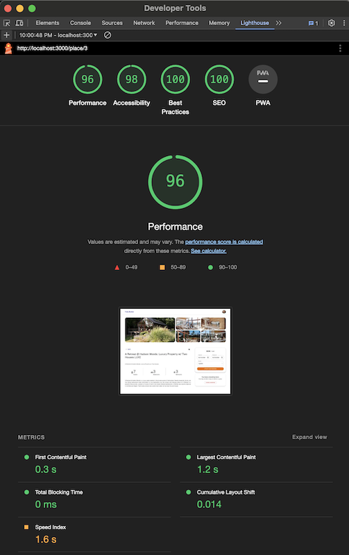
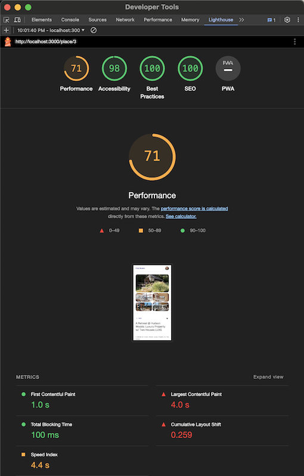

# Fully Booker App

Interview project of Renan Alves.

Bootstrapped with `create-t3-app` and using:
- [Next.js v14](https://nextjs.org)
- [Prisma](https://prisma.io)
- [MUI](https://mui.com/material-ui)

## What's the objective?

Create one webpage that allows a user to create / manage bookings. 
I choose to use Next.js v14 because of it's powerfull set of features, like the Image component and App Router, and also because it supports the new React Server Components and React Server Actions. 
Combined with Prisma.io, Reac Hook Form and Zod, make an incredible stack.

#### *Attention: every request has a forced delay of 1 or 2 seconds to simulate a real network*

## How to test on your machine?

Please clone this repository and run the folloing commands:

`npm install` 
`echo 'DATABASE_URL="file:./db.sqlite"' > .env` 
`npm run db:init` 
`npm run build` 
`npm run start`

## Lighthouse test
- Desktop 

- Mobile 

